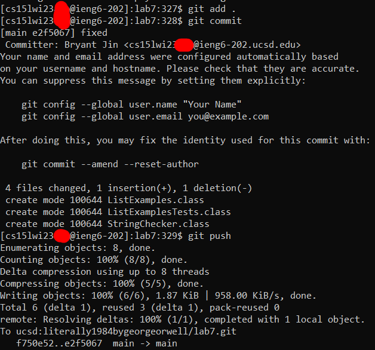

# CSE Labs “Done Quick”: The Journey for a Lab Record

> If one day the speed kills me, do not cry because I was smiling.

*-- Paul Walker, The Fast and the Furious 2*

The Week 8 CSE15L lab was based around a CLI race. Competitors were tasked with accomplishing a series of command line tasks over an SSH connection, with the fastest competitor progressing through a lab-wide single elimination tournament.

As of February 23rd, 2023, I hold the (to my knowledge) class record with a personal best of 2.463 seconds. In this writeup, we will examine performance bottlenecks, evaluate time-saving techniques, analyze the record route, and discuss potential future optimizations. Along the way, we'll talk about some intricacies of both `bash` and `SSH`, as well as how these quirks can have impacts on runtime.

## Overview
We are running the any% category. While the CSE 15L speedrunning community has not reached a consensus, I will proceed under the assumption that this run is TAS, not RTA. While the RTA route is extremely similar to the TAS route, the WR in that category is significantly slower due to typing speed limitations.

The requirements for an any% run are as follows:

1. Delete any existing forks of the repository you have on your account
2. Fork the repository
3. Log into ieng6
4. Clone your fork of the repository from your Github account
5. Run the tests, demonstrating that they fail
6. Edit the code file to fix the failing test
7. Run the tests, demonstrating that they now succeed
8. Commit and push the resulting change to your Github account

The first two steps are not counted in final time, but are still considered part of the speedrun. That is, they are still subject to ordinary speedrun rules and must be done immediately preceding any runs. Thus, we are unable to modify the source repository or change access permissions.

This poses some significant challenges. First, several time-saving strategies are eliminated. Precompilation of source code is prohibited under these rules. A no-auth approach to the repository, while allowed, becomes nonviable.

Our general route for this run will look something like this:
### Setup
1. Fork the repository

### Timed Portion
2. SSH into ieng6
3. Clone the repository
4. Compile and run the code
5. Fix the code
6. Compile and run the code
7. Add, commit, and push the fixed file

## Configurations
Unless specified otherwise, assume the following configurations:

.ssh/config (local):


.ssh/config (remote);


GitHub Username:
literally1984bygeorgeorwell

Repository name:
lab7

## Naive Approach
> There is a difference between being straightfoward and careless.

*-- Nana Patekar*

The naive route consists of running all of these commands consecutively. Using no special options or techniques, we have the following keytrokes:
```
ssh ucsd
<ENTER>
git clone ucsd:literally1984bygeorgeorwell/lab7.git
<ENTER>
cd lab7
<ENTER>
javac -cp .:lib/hamcrest-core-1.3.jar:lib/junit-4.13.2.jar *.java
<ENTER>
java -cp .:lib/hamcrest-core-1.3.jar:lib/junit-4.13.2.jar org.junit.runner.JUnitCore ListExamplesTests
<ENTER>
vi ListExamples.java
<ENTER>
<DOWN><DOWN><DOWN><DOWN><DOWN><DOWN><DOWN><DOWN><DOWN><DOWN><DOWN><DOWN><DOWN><DOWN><DOWN><DOWN><DOWN><DOWN><DOWN><DOWN><DOWN><DOWN><DOWN><DOWN><DOWN><DOWN><DOWN><DOWN><DOWN><DOWN><DOWN><DOWN><DOWN><DOWN><DOWN><DOWN><DOWN><DOWN><DOWN><DOWN><DOWN><DOWN>
<RIGHT><RIGHT><RIGHT><RIGHT><RIGHT><RIGHT><RIGHT><RIGHT><RIGHT><RIGHT><RIGHT>
i
<DEL>
2
<ESC>
:wq!
<ENTER>
javac -cp .:lib/hamcrest-core-1.3.jar:lib/junit-4.13.2.jar *.java
<ENTER>
java -cp .:lib/hamcrest-core-1.3.jar:lib/junit-4.13.2.jar org.junit.runner.JUnitCore ListExamplesTests
<ENTER>
git add .
<ENTER>
git commit
<ENTER>
i
fixed
<ESC>
:wq!
<ENTER>
git push
<ENTER>
```

Annotated with screenshots (and corresponding steps), we have:

1. Fork the repository

	
2. SSH into ieng6

	```
	ssh ucsd
	<ENTER>
	```
	This commands are pretty simple. We connect to the server specified through our SSH configuration.

	
3. Clone the repository

	```
	git clone ucsd:literally1984bygeorgeorwell/lab7.git
	<ENTER>
	```
	This command is also basic. We clone the repository, using the server specified through our SSH configuration and specifying the username and repository corresponding to our fork.

	
4. Compile and run the code

	```
	cd lab7
	<ENTER>
	javac -cp .:lib/hamcrest-core-1.3.jar:lib/junit-4.13.2.jar *.java
	<ENTER>
	java -cp .:lib/hamcrest-core-1.3.jar:lib/junit-4.13.2.jar org.junit.runner.JUnitCore ListExamplesTests
	<ENTER>
	```
	The first command changes our working directory to the newly cloned directory. The second one compiles all .java files, and the third one runs our tester. The `-cp` option allows us to include both Hamcrest and JUnit in our classpath.

	
5. Fix the code

	```
	vi ListExamples.java
	<ENTER>
	<DOWN><DOWN><DOWN><DOWN><DOWN><DOWN><DOWN><DOWN><DOWN><DOWN><DOWN><DOWN><DOWN><DOWN><DOWN><DOWN><DOWN><DOWN><DOWN><DOWN><DOWN><DOWN><DOWN><DOWN><DOWN><DOWN><DOWN><DOWN><DOWN><DOWN><DOWN><DOWN><DOWN><DOWN><DOWN><DOWN><DOWN><DOWN><DOWN><DOWN><DOWN><DOWN>
	<RIGHT><RIGHT><RIGHT><RIGHT><RIGHT><RIGHT><RIGHT><RIGHT><RIGHT><RIGHT><RIGHT>
	i
	<DEL>
	2
	<ESC>
	:wq!
	<ENTER>
	```
	The first command opens `ListExamples.java` in `vi`. The next 53 keystrokes position our cursor before the typo. `i` enters insert mode, `<DEL>` removes the faulty character, `2` fixes the typo, `<ESC>` exits insert mode, and `:wq!` writes then exits the file (forced).

	(screenshot taken immediately before last keystroke)

	
6. Compile and run the code

	```
	javac -cp .:lib/hamcrest-core-1.3.jar:lib/junit-4.13.2.jar *.java
	<ENTER>
	java -cp .:lib/hamcrest-core-1.3.jar:lib/junit-4.13.2.jar org.junit.runner.JUnitCore ListExamplesTests
	<ENTER>
	```
	Again, the first command compiles all .java files, while the third one runs our tester.

	
7. Add, commit, and push the fixed file

	```
	git add .
	<ENTER>
	git commit
	<ENTER>
	i
	fixed
	<ESC>
	:wq!
	<ENTER>
	git push
	<ENTER>
	```
	The first command adds all changed files to the staging area. The second command commits these changes. Since our default editor is `vim`, we first enter insert mode with `i`, write our commit message, exit insert mode with `<ESC>`, then write and exit the file with `:wq!`. The third command pushes our commit to the remote repository.


**NOTE:** If you're really busy and just need to score this lab report, you can stop reading here. These 180 lines should meet all of the requirements for a full score (exact route with keystrokes, screenshots, and explanation of commands). If, however, you're interested in the route optimization, feel free to keep reading.


There are some noticeable inefficiencies in this run. The biggest bottlenecks are the following:
1. File edits
2. Compilation
3. Typing

## File Edits
> Change will not come if we wait for some other person or some other time. We are the ones we've been waiting for. We are the change that we seek.

*-- Barack Obama*

The file edit process in the naive route is far too slow. We fail to use *any* of the shortcuts that make `vi` a good option in the first place; at this point, we might as well just use `nano`!

The naive approach uses 42 inputs to reach the correct line and 11 inputs to reach the correct column. However, `vi` lets us directly input both line numbers and column numbers. 

### Skipping line inputs
We can either use an absolute approach or a relative approach to jump to line number. By typing in a number and inputting `G`, we skip to that line number. This is four keystrokes:
```
43
<SHIFT> + g
```
Readers familiar with `vi` users may be confused about why we use `G` over `H`. This is because they have different behaviors -- while they accomplish the same result in this case, `G` is relative to start of file, while `H` is relative to start of screen. For this route, I chose to prioritize technical correctness.

Alternatively, we can type in a number and press `<ENTER>` to go to that offset. This is three keystrokes:
```
42
<ENTER>
```
Note that we use 42 instead of 43 for this approach. This is because we begin on line 1, so we need to subtract one from our offset to arrive at the correct absolute line number.
Readders familiar with `vi` may note that this command is traditionally preceded with a colon (`:`). I'm not sure why this is not needed in this case, but it seems to work fine, so I opted to minimize keystrokes.

### Skipping column inputs
We can either use an absolute approach or we can use a character search. By typing in a number and inputting `|`, we skip to that column number. This is four keystrokes:
```
12
<SHIFT> + \
```

Alternatively, we can type in a character and press `f` to skip to the first occurrence (on the line) of this letter. This is two keystrokes:
```
f1
```

### Using Replace Mode
Astute readers may have noticed that we use the find keybind (`f`) instead of the till keybind (`t`). This is because we will use replace mode instead of insert mode. This allows us to save a keystroke on deleting the faulty character, overwriting it directly.

This is two keystrokes:
```
r
2
```

### Exiting vi
It is traditional to specify an exclamation mark (`!`) to force the operation. However, since we don't anticipate any errors, this is a wasted keystroke. Our amended version is five keystrokes:
```
<ESC>
:wq
<ENTER>
```

Thus, our original 62 keystrokes is reduced to 12:
```
42
<ENTER>
f1
r
2
<ESC>
:wq
<ENTER>
```

This is a massive time improvement, and represents the lower limit for realistic optimization.

## Compilation
> I am a programmer. If I write code, I don't evaluate the results by what I hope the code will be. I evaluate it by what happens when I compile it. I evaluate it by results.

*-- Brianna Wu*

While compilation is one of the biggest performance bottlenecks in our speedrun, there is little we can do. As discussed in the [overview](#overview), the required two steps in the setup phase prevent us from precompiling bytecode. However, there are still small time saves we can make.

I only did one during the speedrun due to lack of time (and lack of creativity!). We'll discuss the others in the future optimizations section.

### Avoiding Redudant Compilation
We can save time by avoiding redundant compilation. Since we only modify one file, recompiling all Java files is a waste of time. The time save on this is minimal, since there are only two source files anyway, which actually makes this non-viable in RTA due to the increased keystrokes. Since this is a TAS run, keystrokes are a little less relevant, which we'll discuss in the next section.

Anyway, the optimization is simple. On our second compilation, we change our input to:
```
javac -cp .:lib/hamcrest-core-1.3.jar:lib/junit-4.13.2.jar ListExamples.java
<ENTER>
```

## Typing
> If you type adeptly with 10 fingers, you're typing faster than your mind is working.

*-- James A. Michener*

Until now, we've been largely approaching this speedrun like an RTA run. Typing is one of the biggest factors in determining RTA run times, which gives an inherent advantage to fast typers. That's one of the main reasons why we're TASing this run instead -- while I have a pretty fast typing speed, I'm not confident that I can outperform all other runners in the category.

When typing is a factor, keystrokes are extremely important. This is why we optimized 50 keystrokes in the file editing section. We can make similar optimizations to the compilation step by leveraging bash features to autocomplete and run from history (`<TAB>` and `<CTRL> + R` respectively). Due to the file-heavy operations and the command reuse inherent to this run, these two strategies allow us to make huge keystroke savings.

Beyond simple keystroke count, it is also important to consider key position. The exact optimizations depend on keyboard layout, but here is a proposed route that is theoretically optimized for an RTA run using the QWERTY layout:

### Assumptions
.ssh/config (local):


.ssh/config (remote);


GitHub Username:
L

Repository name:
d

### RTA Optimized Route
```
ssh h
<ENTER>
git clone L:L/d.git
<ENTER>
cd d
<ENTER>
javac -cp l<TAB>hamcrest-core-1.3.jar:lib/junit-4.13.2.jar:. *.java
<ENTER>
java -cp l<TAB>h<TAB><BACKSPACE>:l<TAB>j<TAB><BACKSPACE>:. o<TAB>j<TAB>run<TAB>.J<TAB>re L<TAB>T<TAB><BACKSPACE>
<ENTER>
vi L<TAB>.<TAB>
<ENTER>
42
<ENTER>
f1
r
2
<ESC>
:wq
<ENTER>
<CTRL> + r
javac
<ENTER>
<CTRL> + r
java<SPACE>
<ENTER>
git add .
<ENTER>
git commit
<ENTER>
i
i
<ESC>
:wq!
<ENTER>
git push
<ENTER>
```
Several notes here. First: this route is optimized to 186 keystrokes as compared to the original 532 keystrokes. This is a 346 keystroke improvement (~65% improvement). Second, several of the optimizations here come down to personal preference. In many cases, alphanumeric inputs are preferred to `<TAB>` inputs when keystroke count is similar. Similarly, bash history search (`<CTRL> + r`) is preferred to arrow history navigation (`<UP>`) due to personal difficulties in repeated same-key inputs. Other runners may prefer a different RTA route.

Third: as mentioned earlier, we don't care too much about keystrokes since this is a TAS run. The above route loses to our actual WR route by a large margin. With that in mind...

## Machine Superiority
> How inferior the human machine is, compared to man-made machines. They can be decoked, unscrewed, oiled and parts replaced. Decidedly, nature is not a very wonderful thing.

*-- Joris-Karl Huysmans*

Until now, our optimizations have centered around an RTA run. This is for two reasons. First, optimizing for RTA lets us see just how much more effective than TAS is, which I will demonstrate in a moment. Second, and much more importantly, the entire point of this lab was to demonstrate terminal shortcuts, like autocomplete and command history. While a TAS run teaches us very useful technical details (such as, for instance, command parallelization), this was probably not the objective of the lab. The route above is a demonstration of the "moral" of the lab, so to speak.

However, this is not the best we can do. My personal record for an RTA run uses the above route and clocks in at 51.223 seconds. This is a far cry from the 2.463 second TAS record. Of course, I don't run RTA -- an experienced runner could probably finish this run in around 20 seconds.

That's still an almost 18 second difference. The initial SSH command is actually not included in official CSE15L any% speedrun timing. Instead, timing begins upon execution of this command; that is, timing begins when we establish a connection to the server. Since SSH allows us to provide commands as an argument, we can effectively "reduce" an extremely large number of keystrokes by moving as many inputs as possible to the SSH command.

The first objective for a WR TAS route, then, should be to minimize the remaining keystrokes (referred to in this writeup as effective keystrokes, or EK). The RTA route listed above can be directly adapted to a TAS run with 73 EK, giving us a further 113 keystroke improvement.

The WR route, however, has 0 EK. In order to do this, we must eliminate all interactive commands, namely our file editor calls.

## File Edits 2: Electric Boogaloo
> Well, real programmers use ed.

*-- Randall Munroe, XKCD #378*

> This [...] represents the lower limit for realistic optimization.

*-- Me, about 100 lines ago*

This is a speedrun, not real life. Realism isn't a prerequisite for a successful run. While editors let us visually inspect files, we have, for lack of a better term, omniscience. Visual confirmation is pointless.

### Debugging
We know exactly what the bug is and how to fix it, so we don't have to actually see the bug. Instead, we can use `sed` to directly do an in-place modification.

Power users may be familiar with `sed`'s find and replace syntax, which takes the form `s/find/replace`. Lesser known, however, is the capability for this command to target specific occurrences. Specifically, we wish to target the 9th occurrence of the phrase "index1" and replace it with "index2". Additionally, we need to specify two options:

1. `i` - modifies file in-place (`sed` outputs to STDOUT by default)
2. `z` - processes input file as a null-terminated string (`sed` targets within a single line by default, so we must parse the entire file as one line to target the correct string)

This yields us with the following input:
```
sed -i -z 's/index1/index2/9' ListExamples.java
```

This is considerably more keystrokes than our previous optimization (47 versus 20), which makes this not an RTA-viable optimization. However, since opening an editor forces us to perform manual inputs, this is crucial for a TAS speedrun.

### Committing
The `git commit` command takes an optional `-m` option, which allows us to include a commit message. This is generally considered bad practice because it encourages short commit messages, which are undescriptive. Taking the time to write out a proper commit message in an editor, with a separate subject line from message and a description of changes, is ideal.

In the world of speedrunning, "good practice" is synonymous with "time loss" and "loss of WR pace". So, we're going to do it anyway.

```
git commit -m "fixed"
```

This change, interestingly enough, actually *saves* keystrokes, unlike our `sed` change. This is because we need a keystroke to enter insert mode and 6 keystrokes to exit `vi`, while we only need 4 keystrokes to use the `-m` flag (the quotation marks are optional for single-word messages).

In combination, these changes increase our keystrokes by 25, but reduce our effective keystrokes by 73, down to a total of 0 EK. This is huge.

## Consolidating for a TAS Run
> Great things are done by a series of small things brought together.

*-- Vincent Van Gogh*

Before we make any other changes, we should first try our optimized TAS run to get some benchmarks. By taking our [naive approach](#naive-approach), applying our file editor changes, and replacing `<ENTER>` inputs with semicolons, we can construct the following one-liner:

```
git clone ucsd:literally1984bygeorgeorwell/lab7.git; cd lab7; javac -cp .:lib/hamcrest-core-1.3.jar:lib/junit-4.13.2.jar *.java; java -cp .:lib/hamcrest-core-1.3.jar:lib/junit-4.13.2.jar org.junit.runner.JUnitCore ListExamplesTests; sed -i -z 's/index1/index2/9' ListExamples.java; javac -cp .:lib/hamcrest-core-1.3.jar:lib/junit-4.13.2.jar ListExamples.java; java -cp .:lib/hamcrest-core-1.3.jar:lib/junit-4.13.2.jar org.junit.runner.JUnitCore ListExamplesTests; git add .; git commit -m "fixed"; git push
```

This one-liner actually abandons much of the RTA optimizations we made in our [final route](#rta-optimized-route). This is because most of these optimizations either hurt readability or are no longer applicable. The only one we kept was the compilation optimization.

Now, we can simply provide this one-liner as a parameter for our SSH command, executing them the moment a successful connection is established. Due to the small time margins of TAS runs, we will use the `time` command to accurately measure our speedrun time.


10 seconds! Much faster than our estimated RTA record, but still a bit off from our world record.

## Optimizing TAS Runs
> Without continual growth and progress, such words as improvement, achievement, and success have no meaning.

*-- Benjamin Franklin*

When it comes to optimizing TAS runs, we no longer care about keystrokes -- as long as we have 0 EK, the actual keystrokes of our route no longer matter. What metrics should we be optimizing, then?

Time loss on actual computational systems come down to two things: processing time and waiting time. Thus, our route must minimize computational tasks and avoid as much processor downtime as much as possible.

## Minimizing stdout Access
> Please, just stop talking.

*-- My English Teacher*

File writes are very expensive operations. Data streams are no exception. As anybody who has forgotten to comment out debug information can tell you, console output can substantially impact runtime.

While our route doesn't have too much output, we should still eliminate as much output as possible in the interest of optimization. Since steps 5) and 7) of the speedrun require that we demonstrate the tests failing/passing, they are necessary output. All other output can go.

Examining our earlier run, we can see three additional sources of output: `git clone`, `git commit`, and `git push`. All other programs run in quiet mode by default. Let's make `git` do that too.

By supplying the `-q` option to all three of these commands, we can eliminate unnecessary output to stdout, marginally decreasing our time.

```
git clone -q ucsd:literally1984bygeorgeorwell/lab7.git; [commands omitted]; git commit -q -m "fixed"; git push -q
```

This is the only processing time optimization I made during the WR run. Additional optimizations are discussed in the [future optimizations section](#future-optimizations).

## Command Parallelization
Now we can begin eliminating downtime. Bash supports a surprisingly robust set of control operators. We'll be using the two list terminators: `;` and `&`.

`;`, as we've already seen, allows us to run commands synchronously. However, not all of our commands need to be run in sequence. For example, after our code has been compiled, further changes to the sourcecode will not change the compiled bytecode. So, we can run the java program simultaneous to our bugfixes.

This is where `&` comes to the rescue. This list terminator runs the previous command in the background, then executes the second command in the foreground. There are some intricacies to this syntax if we want to, for instance, run multiple commands in the background. However, this TAS run never executes more than two commands simultaneously, so this is not an issue for our run.

This was our previous route:

1. Clone the repository
2. Change into the cloned repository
3. Compile the code
4. Run the code
5. Fix the code
6. Compile the code
7. Run the code
8. Add the fixed file
9. Commit the staged files
10. Push the commit

After parallelization, we have this much more compact route:

1. Clone the repository
2. Change into the cloned repository
3. Compile the code
4. Run the code & Fix the code
5. Compile the code & Add the fixed file
6. Run the code & Commit the staged files
7. Push the commit

Putting this into action, we have the following parallelized one-liner:
```
git clone -q ucsd:literally1984bygeorgeorwell/lab7.git; cd lab7; javac -cp .:lib/hamcrest-core-1.3.jar:lib/junit-4.13.2.jar *.java; java -cp .:lib/hamcrest-core-1.3.jar:lib/junit-4.13.2.jar org.junit.runner.JUnitCore ListExamplesTests & sed -i -z 's/index1/index2/9' ListExamples.java; git add . & javac -cp .:lib/hamcrest-core-1.3.jar:lib/junit-4.13.2.jar ListExamples.java; java -cp .:lib/hamcrest-core-1.3.jar:lib/junit-4.13.2.jar org.junit.runner.JUnitCore ListExamplesTests & git commit -q -m "fixed"; git push -q"
```

Note that this one-liner is actually not ordered in the optimal pattern. This, too, will be discussed in the [future optimizations section](#future-optimizations).

Now, let's try running our new route:


Better by almost a full second! But still not quite at the record pace.

## Network Latency
> It was the lag, I swear!

*-- some salty guy*

The biggest killer for this run is network latency. This is obvious even without any benchmarking: there is a visible delay between the SSH command being sent and the server MOTD being displayed. Is there anything we can do about this?

There are many techniques, actually. Unfortunately, most of them are unfeasible for a variety of reasons. The easiest way to reduce network latency would be to reduce network distance. If we had administrative access to the UCSD network, we could create a direct route from our machine to the ieng6 servers, minimizing hop count. Similarly, if we had administrative access to the ieng6 servers, there are a variety of network optimizations we could make (most of which come at the cost of security or user experience).

The situation isn't completely hopeless, though. The exact details of network sockets is extremely complex and out of the scope of the writeup. The rest of this writeup will assume a familiarity with basic network concepts.

`ssh`, like all network commands, must open a network socket to facilitate communication. If we can perform socket caching, we could cut down on socket creation time, which is relatively costly on systems. More importantly, we can avoid most layer two and layer three initialization delays, and even possible some layer four negotiations. More importantly, we can cut negotiation time out entirely: the handshake only occurs once per socket.

A quick look into the documentation shows us that OpenSSH supports both socket reuse and multiplexing. By configuring a multiplexing controller, we can specify a socket cache directory and a cache lifespan.

Specifically, we want to use the `ControlMaster`, `ControlPath`, and `ControlPersist` configuration directives. By applying this configuration to both our local machine and the remote server, we should be able to drastically cut down on initial connection and git operations, both of which take place over SSH connections.

While we're at it, let's make a few more optimizations. In the configuration, we can additionally specify a preferred authentication method. By specifying one in advance, we can reduce handshake length. This doesn't really help, since we're already caching sockets, but we might as well use it. For some reason, this doesn't work for GitHub (potentially because of their SSH configuration), so we only apply this change to our local machine.

Outside of our configuration, we can also use some options with `ssh`. Specifically, `-T` will disable PTTY allocation. We don't need a pseudo-terminal, since none of our commands run interactively. PTTY allocation is relatively expensive, and this option should allow our session to be instantiated a little faster. This performance bonus is minimal, but every millisecond counts.

Combining all of our changes, we have an optimized TAS run.

### Assumptions
.ssh/config (local):


.ssh/config (remote);


### TAS Optimized Route

```
time ssh ucsd -T "git clone -q ucsd:literally1984bygeorgeorwell/lab7.git; cd lab7; javac -cp .:lib/hamcrest-core-1.3.jar:lib/junit-4.13.2.jar *.java; java -cp .:lib/hamcrest-core-1.3.jar:lib/junit-4.13.2.jar org.junit.runner.JUnitCore ListExamplesTests & sed -i -z 's/index1/index2/9' ListExamples.java; git add . & javac -cp .:lib/hamcrest-core-1.3.jar:lib/junit-4.13.2.jar ListExamples.java; java -cp .:lib/hamcrest-core-1.3.jar:lib/junit-4.13.2.jar org.junit.runner.JUnitCore ListExamplesTests & git commit -q -m "fixed"; git push -q"
```


This is only 0.233 seconds off of my record of 2.463 seconds (screenshot below). This final difference can mostly be accounted for by various dynamic factors, like current network load.


## Future Optimizations
> There's a lot of clarity in hindsight.

*-- Julia Hartz*

The route provided above is the exact route I used in my record run, and is how I got the dubious honor of "'Done Quick' Champion". However, with several days to reflect on this route, I have several changes I would like to make.

### Additional Java Optimizations
`ListExamples.java` doesn't ever reference JUnit, and therefore does not need to be compiled with JUnit and Hamcrest in its classpath. Thus, we can simplify our second compilation to:

```
javac ListExamples.java
java -cp .:lib/hamcrest-core-1.3.jar:lib/junit-4.13.2.jar org.junit.runner.JUnitCore ListExamplesTests
```

This by itself saves a small amount of runtime. However, there are additional options for both `javac` and `java` that can massively save time.

`javac` automatically generates debug information. This is helpful for debugging, but we already know what the bug is. By specifying `-g:none`, we avoid generating this information. Similarly, we do not need to run a linter, any annotation processors, or generate implicitly loaded classes. 

This gives us an initial compilation of
```
javac -cp .:lib/hamcrest-core-1.3.jar:lib/junit-4.13.2.jar -g:none -implicit:none -proc:none -nowarn *.java
```
and a second compilation of
```
javac -g:none -implicit:none -proc:none -nowarn ListExamples.java
```

`java` has some similar QoL features that are negatively impacting our performance. By default, a bytecode verifier runs on all bytecode before execution. We can disable this with `-Xverify:none`. Additional changes (that offer minimal benefits) include decreasing the garbage collector pause time and enabling aggressive optimization. This gives us an optimized:

```
java -cp .:lib/hamcrest-core-1.3.jar:lib/junit-4.13.2.jar -Xverify:none -XX:MaxGCPauseMillis=10 -XX:+AggressiveOpts org.junit.runner.JUnitCore ListExamplesTests
```

While decreasing allocated memory and further modifying the garbage collector could potentially bring other performance benefits, there is extremely little benefit to be gained from further optimization and so this writeup does not explore this avenue any further.

### Parallelization Optimizations
As mentioned earlier, `bash` will execute the command *before* an `&` symbol in the background and the command *after* in the foreground. Therefore, we should 

Actually, it's 9:36PM and I'm not finishing this in time. Sorry.