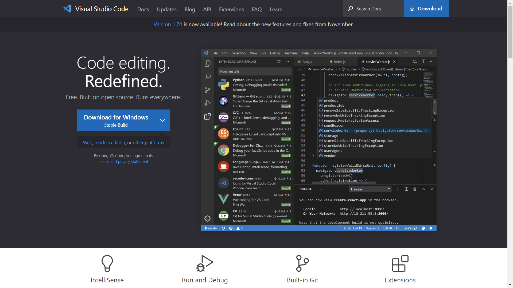
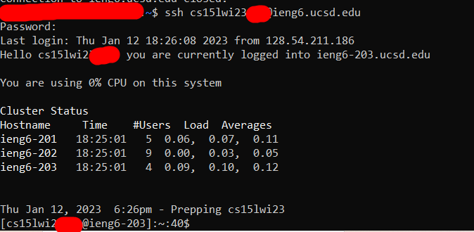
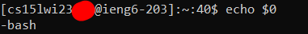
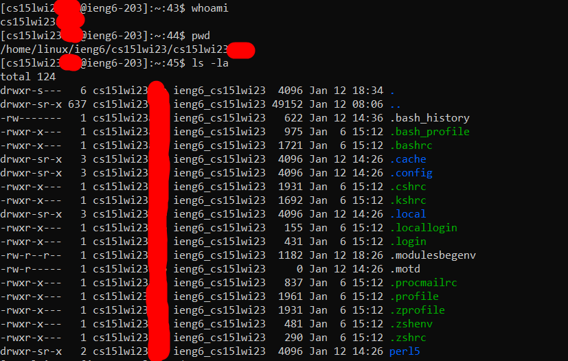

# Remote Access: A (Non)Comprehensive Guide

## Installing VSCode
VSCode is a commonly used IDE, and apparently the de facto editor used for this course. VSCode can be downloaded from the [official website](https://code.visualstudio.com/), and is available for Windows and most \*nix systems. The download page should look something like this:
[

I don't have any actual images of the installation process or specific instructions for how to use the installer, since I didn't download it. I don't konw if that's a sufficient explanation for "why not". I prefer a different editor.

## Remotely Connecting
VSCode should have options to remotely connect to servers. There's an included terminal that you can use, and if memory serves correctly, there are also extensions you can download to make your job easier. Since, again, I don't actually use this IDE, I can't offer guidance on how to do it.

Instead, I'll detail the remote access process for Linux. I'm using a Debian-based system (Ubuntu 20.04 Focal Fossa), but this process should be universal across any Linux system. And most \*nix systems, now that I think about it.

Almost every distro should come with `ssh` shipped, but should be widely obtainable from online sources if not. Use the appropriate package manager (`apt` for for Debian-based systems) and install as needed. If your sources are compromised or the `ssh` package is otherwise not available, OpenSSH provides binaries on their [website](https://www.openssh.com/).

For CSE15L, we'll be using the SSH gateway (?) found at `ieng6.ucsd.edu`. Specify your corresponding user account and append the hostname, separating the two with and `@`. It should look something like this:

```
ssh cs15lwi23zz@ieng6.ucsd.edu
```

Enter the password when prompted, and you should be connected to the system. Successful access should look like the following:
[

## Trying Some Commands
Now that we have remote accesss, let's run some basic diagnostic commands. First, we'll figure out what interpreter we're running. Run `echo  $0` and note the result. It looks like the configuration for CSE15L defaults to `bash`.

[

We can also look at what user we're running commands as and get an idea of where we are and what that filesystem looks like. `whoami` displays the name of the current user, `pwd` displays the current working directory, and `ls` will list the files in a specified directory, defaulting to the current one if none is supplied.

[

We can also look at various other bits of interesting system information, like currently used resources (via `top`) or available disk space (via `df`), but that's a bit out of scope for a remote access tutorial.

Good times were had by all.