# Researching Commands: The Art of `Find`ing Yourself

> You’ve got to find yourself first. Everything else’ll follow.
*-- Charles de Lint*

Hi! I may have gotten a bit carried away writing some of this report (it feels *wrong* to mention `-atime` but then ignore `-perm`!) and reached a lot more than 4 flags. If you're in a rush, feel free to skim the `Filename Parameters` section and move on. The rest of the options are only provided for information purposes.

## Sources Used (boring disclaimer)
All information in this lab report was derived either from personal experience or from the current version of the man-pages project (5.13 as of February 2023). No other sources were consulted during research.

## Overview
The `find` command is part of the GNU Find Utilities, and is included by default with pretty much every major Linux distro.  First, let's look at what it does. According man-pages-5.13 (current as of 2021-08-27),

> GNU find searches the directory tree rooted at each given starting-point by evaluating the given expression from left to right, according to the rules of precedence (see section OPERATORS), until the outcome is known (the left hand side is false for and operations, true for or), at which point find moves on to the next file name. If no starting-point is specified, `.' is assumed.

Ignoring the finer details (which is really only relevant to security researchers and power users), the description seems pretty straightforward. `find` evaluates the provided expression (which mostly follows standard Unix glob syntax) and then searches within the specified directory tree, defaulting to the current directory if none is specified.

This simple description conceals a *very* powerful program consisting of more than 1500 lines of source code. Let's take a look at some reasons why `find` is so powerful.

## Filename Parameters
Let's start with the most straightforward options. `find` lets you filter by various attributes of the filename. For the next few commands, assume the following directory structure:

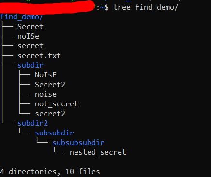

### -name
The `-name` option lets us specify a glob pattern (called "shell pattern" in all GNU Find Utilities) and will return all files that match that pattern. If we do not use any wildcards, `find` will do a direct match; that is, it will not search for substrings.

In the example below, we search the example directory for the exact string "secret".

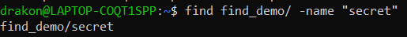

Thus, for most usecases, we will want to use some combination of wildcards to instead search for substrings. The exact art of doing this is out of the scope of this report, but the following is one example of how all filenames beginning with the string "secret" may be found.

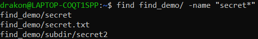

### -iname
There is one important thing to note about the `-name` option, however: it is case sensitive. While this is often the desired behavior, users may sometimes want to perform a case insensitive search. It is possible to construct a shell pattern that would match case insensitive filenames, but it would be much easier to use `-iname`, the insensitive name search.

In the example below, note how all files with the filename "noise" are matched, regardless of case.
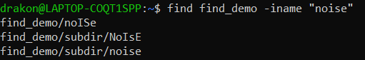

As with any option that takes a pattern, `-iname` can parse wildcards. In the example below, all instances of the substring `secret` are matched. Note the additional files that were not included in our `-name` search using the same pattern.
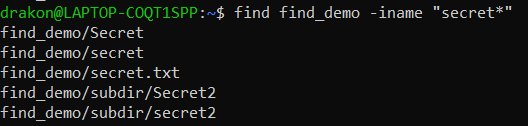

### -path
Both `-name` and `-iname` will only match the actual filename. If you want to search for entire filepaths, the `-path` command allows you to specify one. This has the obvious use of letting us search only for nested files, for instance:
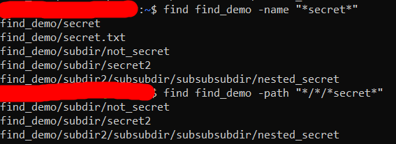

Notice how the output of the second command does not contain `secret` or `secret.txt`, as they are in the base directory.

There is, however, a much more subtle use of this command. Using `find` on a nonexistent directory will throw an error -- something which can be undesirable for a variety of reasons. Specifying the directory as part of `path`, however, will simply return no results. While this has no immediate use in an interactive shell, this can greatly simplify error handling in shell scripts with user-supplied input. 

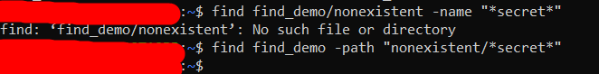

Note the lack of output to stderr in the second command.

### -regex
Like all good search tools, `find` supports regular expressions. The shell patterns used natively by `find` are not very powerful: they only support the two basic wildcards, character classes, and escape characters. Thus, more sophisticated searches will often rely on the `-regex` option.

In the following example, a (very primitive) regular expression is used to find all Windows SIDs from a dump of extracted files.

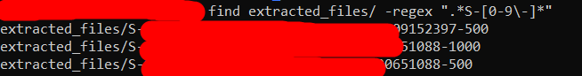

`find` also supports different regular expression flavors via `-regextype`. The default regular expressions are not very powerful -- we can write a better regular expression after specifying `posix-extended`.

The new regular expression is much more specific and true to the SID format.

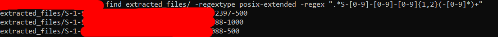

## Time Parameters
`find`, however, is much more powerful than simple filename matches. In fact, `find` can match by various metadata values, including creation and modification time. Due to the nature of these options, they are most typically used in incidence response or other metatasks involving analyzing system usage (for example, determining which files a hacker has read or listing out all files that have not been updated in a long time). Nonetheless, they are still incredibly useful options and should be learned.

I was unable to deliberately construct an example directory for these examples, since messing with file metadata is a bit too much work for a lab report. As such, I do not have a reference directory tree available. 

Note that the options broadly exist for access time (`a`), status change time (`c`), and modification time (`m`). Instead of listing out all 11 commands, I elected instead to list out the suffixes, since they are all similar in functionality. The exact commands are listed below each suffix.

### -*time
Actual options: `-atime`, `-ctime`, `-mtime`, `-used`.

The `-*time` family of options match any file whose time attribute is within a certain range, specified by `n` (days). There are three possible formats for `n`:  
`+n` matches any value *greater than* `n`  
`n` matches the exact value `n`  
`-n` matches any value *less than* `n`  

In the below example, the `-atime` flag is used to find files accessed within the last 5 days. In that time, I had modified my `ssh` configuration, connected to my oracle server (using the `oci` tool), and executed example `find` commands in my example directory.
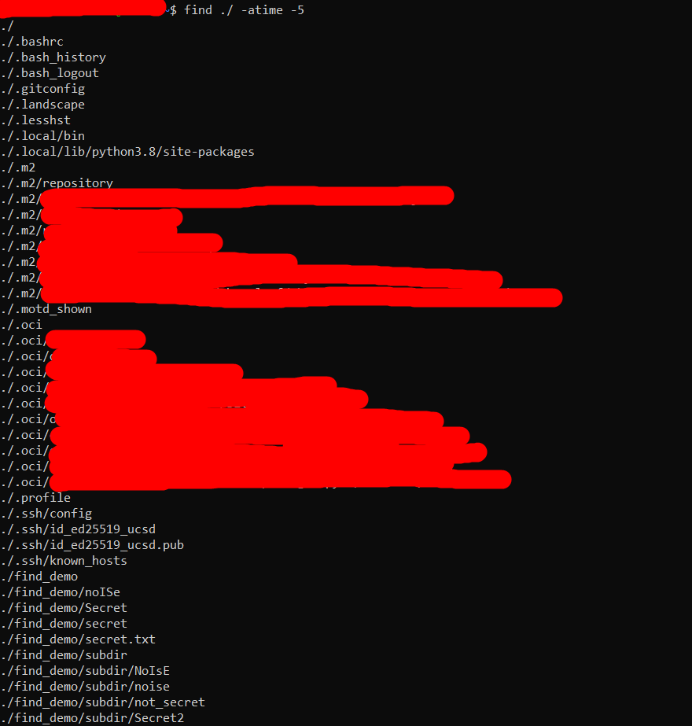

In the below example, the `-mtime` flag is used to find project files that have not been modified in around a year. Note that I use `grep` to exclude `.git` files. While `find` has options (such as `-prune`) to exclude directories and files, I forgot to explain them earlier in the lab report so I decided not to use them.

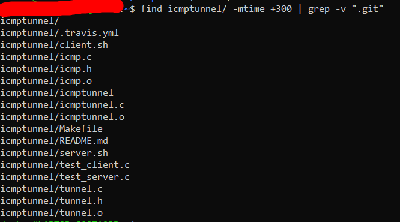

### -*min
Actual options: `-amin`, `-cmin`, `-mmin`.

The `-*min` family of options is nearly indentical to the `-*time` family, using minutes instead of days for its time unit.

In the below example, the `-amin` flag is used to find recently accessed files. I had recently installed a package with `pip` and pushed a repository using `git`.

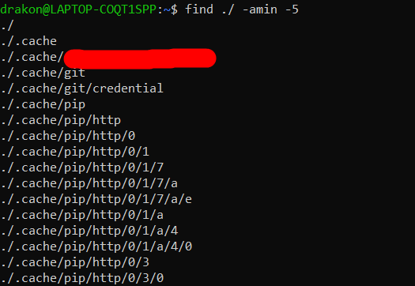

Note that the example above is actually truncated. On modern systems, hundreds of files are being accessed in any given minute. Thus, performing a system-wide search (or even within the home directory) will return an extremely long list of files. Typically, `-atime` and `-amin` should be used in conjunction with the `-name` and `-path` options to ignore these commonly accessed files.

As mentioned earlier, these commands are particularly useful for incidence response. In the following scenario, an evil hacker has infiltrated the system. In response, we are conducting a security audit to search for Indicators of Compromise (IoC). The example below shows how the `-mmin` command can be used to locate a malicious executable that was recently hidden on the system.
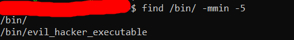

### -*newer
Actual options: `-anewer`, `-cnewer`, `-newer`, and `-newerXY`.

The `-*newer` commands allow us to match any file whose time parameter is less than some reference file. This is, again, particularly useful for incidence response. In the following example, we know that the infiltrator has read the list of secret passwords. We are interested in finding what other files they may have accessed. The example below shows how the `-anewer` command can be used to generate a list of these files.

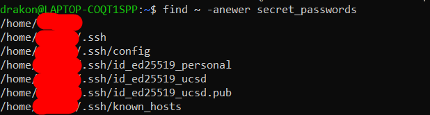

We now know that the hacker has stolen my private keys and read my SSH config file! I also read the `/etc/shadow` file and modified the `/etc/hosts` file, but neither of these showed up since I only searched within my home directory. 

These commands can also be used to find recent changes in large projects. In the example below, the `-newer` option allows us to find the Javascript files that have been changed since `app.js` was last updated.

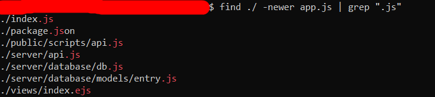

## Status Parameters
`find` can also search based off of other file metadata like file permissions, UID, GID, and size. While there are many such options, I will only explore two for the sake of brevity.

### -perm
The `-perm` option actually has four different accepted formats, and as such is listed four different times in the man pages. The exact format is a bit complex and is better explain by the man pages, but the basic idea is that the option allows you to search for specific permissions. The option accepts either octal permissions or symbolic permissions. The rest of this section will assume a familiarity with Unix permissions. For a crash course on permissions, see [here](#on-permissions).

`-perm` is most useful for system auditing. In particular, it can be used to detect incorrectly configured permissions. In the following example, all files set to `777` are returned. While there are cases where this permission level is correct, it is *generally* considered bad practice and should be avoided when possible.

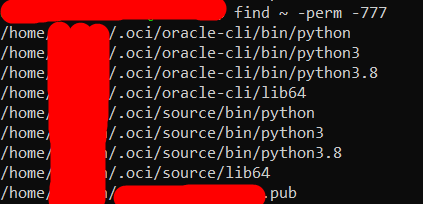

One particular example of the `-perm` option comes with detecting SUID binaries. The significance of these binaries is out of the scope of this lab report, but there is significant interest in finding (and, if necessary, removing) these binaries when securing a system. The following example lists all SUID binaries on a remote server.

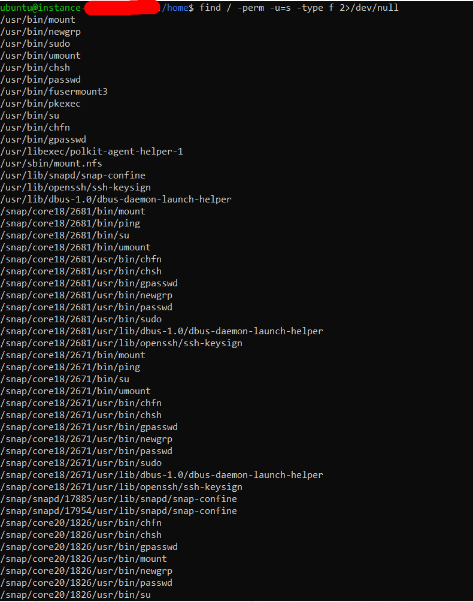

The inclusion of `2>/dev/null` at the end pipes `stderr` to `/dev/null`, ensuring that file access errors are suppressed. For a crash course on file descriptors, see [here](#on-file-descriptors).

### -size
The `-size` option accepts a variety of size units. By default, `find` uses "data blocks" (`b`), which the GNU Find Utilities define as 512 bytes. Alternative units include bytes (`c`), words (`w`), kilobytes ("kibibytes" under IEC 80000, `k`), megabytes ("mebibytes" under IEC 80000, `M`), and gigabytes ("'gibibytes" under IEC 80000, `G`).

As with the time-based commands, a `+` or a `-` can be prefixed to specify greater than or less than, respectively. This command is most often used to find and eliminate file bloat, as seen in the example below:


Since all options can be used multiple times, this gives us an extraordinary amount of control over file searches. In the following example, two `-size` options are used in conjunction to search through system binaries, returning all files that are larger than 10 megabytes but smaller than 10 gigabytes.

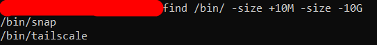


# Appendix

## On Permissions
Linux file permissions break very neatly down into a triplet of triplets. There are additional file bits (filetype and extended attributes), but those are generally considered separately from the core file permissions.

The core file permissions can be broken down into universal permissions, group permissions, and owner permissions. The owner and group are given by the UID and GID of the file (as breifly mentioned in `Status Parameters`). The exact details of a UID and GID are not important, but readers are expected to understand that the UID refers to a specific user ("owner") and the GID refers to a group of users ("group owner" or "owning group"). Generally the UID belongs to the GID, although this is not always the case.

Permissions are checked in the order Owner, Group, Others. Thus, the owner of a file will be subjected to its owner permissions, even if they are in the owning group. Counterintuitively, this means that an owner can actually have *less* permissions than the group! Of course, since the owner can change the permissions of a file at will, this point is more theoretical than anything.

Each of these permissions is composed of three further subpermissions: read, write, execute. One example permission, thus, could be the following:

Owner: Read, Write, Execute  
Group: Read, Execute  
Others: Execute

In the above example, the owner has full access to the file in question, while the group can read and execute it but not edit it. All other users can only execute the file.

Unix systems have two different formats used to refer to permissions: octal format and symbolic format. The choice of format is typically a personal one -- I have always used the octal format. Both are accepted by `find`.

The octal format represents each permission as a bit. MSB first, the permissions are read, write, execute. In decimal, read is represented by 4, write is represented by 2, and execute is represented by 1. From left to right, permissions are listed owner, group, others. Below is an example permission and its binary conversion:

```
644
110 010 010
```

Thus, the permissions reads as:

Owner: Read, Write
Group: Read
Others: Read

The symbolic format represents permissions with letter codes. Refer to the below table for specific codes.

|  Permission  | Letter |
| ------------ | ------ |
|     Read     |   `r`  |
|     Write    |   `w`  |
|    Execute   |   `x`  |
|     Owner    |   `u`  |
|     Group    |   `g`  |
|    Others    |   `o`  |

Below is the same example permission in symbolic form:

```
u=rw
g=r
o=r
```

Sometimes, like with the output of `ls -l`, the "owner", "group", and "others" codes are omitted and permissions are instead displayed in the same order as octal permissions, as in the example screenshot below.


## On File Descriptors
File descriptors are handles for files, pipes, or sockets. Users familiar with Linux syscalls may recognize file descriptors from syscalls like `open` and `clone`.

Unix systems should be POSIX compliant, and thus the following three file descriptors refer to the standard streams:
| Value |    Full Name    | stdio Name |
| ----- | --------------- | ---------- |
|   0   |  Standard Input |    stdin   |
|   1   | Standard Output |   stdout   |
|   2   |  Standard Error |   stderr   |

Bash allows us to redirect file descriptors. In fact, three of the operators we have already learned in class are actually doing FD redirection. `|`, `>`, and `<` all redirect file descriptors. Since `>` takes `1` by default and `<` takes `0`, they allow us to "pipe to a file" or "read from a file" when no explicit FD is specified. Similarly, `|` takes `1` for input and `0` for output by default, allowing us to "chain commands". This is what really happens when we run a command like `find > files.txt`: the command output, which ordinarily goes to FD `1` (stdout) is instead piped to the FD referring to `files.txt`.

This understanding of file descriptors is very important to understanding pipe behavior. More importantly, it allows us to go beyond default settings and engage in FD manipulation. 

In our earlier example, `2>/dev/null` simply takes FD `2` (stderr) and redirects it to `/dev/null`, effectively discarding error messages. This makes our visual output much cleaner, since we do not actually see errors. A similar effect could be accomplished by piping `stdout` to a file and reading it. My personal favorite (in consensual, ethical, and approved penetration testing engagements) is piping my stderr to a socket pointing to a compromised `audit.log`, flooding logged events with errors.