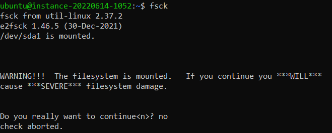
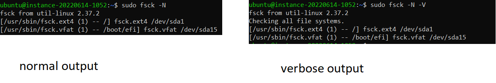
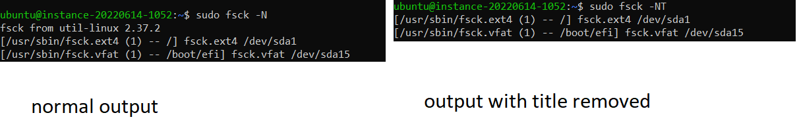
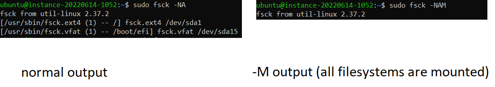
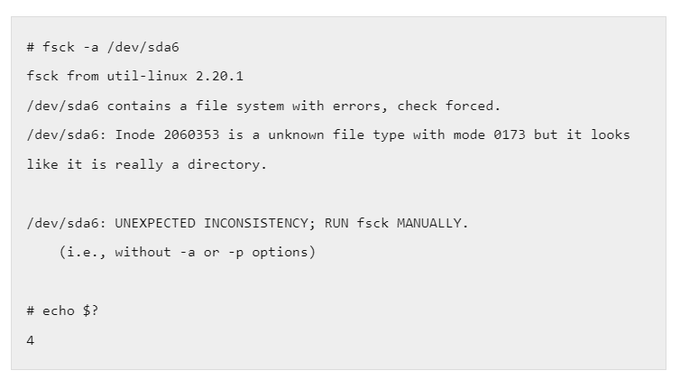

# Researching Commands: No `Fsck`s Given

> My cabbages!

*-- The Cabbage Merchant*

> My filesystem!

*-- pretty much anybody who's ever messed with `dd`*

Let's talk about `fsck`. Yes, the pun is obvious. Computer scientists have been making that joke since 1998. In a moment of weakness, I made it in the title. Now that we've gotten that out of our systems, we will never acknowledge the linguistic similarity ever again.

Apologies in advance for the relative lack of examples. I'm not breaking my hard drive just for this lab report. See the screenshot below for why running `fsck` on your system when nothing is broken is a terrible idea:

## Sources Used
All information in this lab report was derived either from personal experience or from the current version of the man-pages project (5.13 as of March 2023). No other sources were consulted during research.

## Overview
The `fsck` command, short for "file system consistency check", is a system utility used to check and, when possible, repair Linux file systems. It's an incredibly powerful tool for undoing what we in the industry call a "pro gamer moment".

### Basic Usage
Use `fsck` on a filesystem. That's all it is. 

Example usage:
`fsck /usr`

Ideally, this solves all of your problems. Sometimes it doesn't.

### Error Codes
According man-pages-5.13, the `fsck` exit code takes the following format:

> The exit code returned by fsck is the sum of the following conditions:  
0 - No errors  
1 - File system errors corrected  
2 - System should be rebooted  
4 - File system errors left uncorrected  
8 - Operational error  
16 - Usage or syntax error  
32 - Fsck canceled by user request  
128 - Shared library error  
The exit code returned when multiple file systems are checked is the bit-wise OR of the exit codes for each file system that is checked.

This is a really weird way to write it. In more familiar terms, the exit code is an 8-byte value. The error conditions above are listed in LSB order. So, `10010010` (146) would correspond to "File system errors corrected", "Operational error", and "Shared library error".

Because a bit-wise OR is performed when multiple file systems are checked, this exit code will simply capture all errors. If you'll allow an electrical engineering analogy, the bits are essentially latches with no reset input.

## Trivial Options
Let's start with the options that pretty much every command line tool has.

### -V
The `-V` option specifies that verbose output should be produced. This is pretty self-explanatory. Mostly, this outputs any fs-specific commands that were executed. It also adds information on which steps were run. Extremely limited example below:

Example usage:
`fsck -V /dev/sda1` 

### -N
The `-N` option specifies that `fsck` should be executed speculatively. This lets you see what `fsck` would have done without actually making any changes. Normally, this is used when you want to diagnose a filesystem but don't necessarily want to modify it yet.

It's also useful for getting examples for your CSE15L lab report without destroying your system.

Example usage:
`fsck -N /dev/sda1`

### -T
The `-T` option specifies that the title doesn't get displayed. That's literally it.

Example usage:
`fsck -T /dev/sda1`

## Checker Options
These options specify which filesystems should be checked.

### -A
The `-A` option specifies that `fsck` should read `/etc/fstab` and check all filesystems. Note that any `fstab` entries with an `fs_passno` value of 0 will be skipped. All other entries are checked in ascending order of `fs_passno` values.

The root filesystem is checked before all other filesystems. Any filesystems with the same `fs_passno` value will be checked in parallel.

Example usage:
`fsck -A`

### -P
The `-P` option is used in parallel with the `-A` option, and specifies that the root filesystem should be checked in parallel to other filesystems. This is discouraged, since it is unsafe to perform `fsck` operations before verifying the integrity of the root filesystem.

Example usage:
`fsck -AP`

### -R
The `-R` option is used in parallel with the `-A` option, and specifies that the root filesystem should not be checked.

Example usage:
`fsck -AR`

### -M
The `-M` option specifies that `fsck` should not run on mounted filesystems. If a mounted filesystem is encountered, `fsck` should exit with code 0. While there are cases in which you want to run `fsck` on a mounted system, this is generally undesired. It is recommended to specify `-M` by default to avoid any footguns.

Example usage:
`fsck -M /dev/sda1`  
`fsck -AM`

### -C
The `-C` option specifies that `fsck` should display progress bars for filesystem checkers. Currently only the checkers for `ext2` and `ext3` filesystems support progress bar displays.

Example usage:
`fsck -C /dev/sda1`

### -t
The `-t` option specifies a list of filesystem types to be checked. The list of filesystems should be specified as a comma-separated list of `filesys` entries. An optional negation operator (`no` or `!`) can be prefixed to specify that filesystems that do *not* match that type should be checked.

Filesystem options can additionally be specified using the `opts=` prefix. These filesystems should correlate to valid mount options in `/etc/fstab`.

When used in tandem with `A`, this filesystem list functions as a filter.

Example usage:
`fsck -t ext3 /dev/sda1`  
`fsck -A -t ext2`  
`fsck -A -t noext4`  
`fsck -A -t ext2,ext3,opts=ro`

## Operation Options
These options specify behavior for checker operations. Most of these options are concerned with filesystem-specific checkers, but five of them are (near) universal.

### -s
The `-s` option specifies that `fsck` operations should be run in serial, instead of in parallel. This is mainly used for interactive checkers.

Example usage:
`fsck -s /dev/sda1`

### -a
The `-a` option specifies that a checker should automatically repair the filesystem with no user prompts. When `-a` is specified, `fsck` will exit with code 4 if a complex problem is encountered.

Image sourced from https://www.thegeekstuff.com/2012/08/fsck-command-examples/:

Example usage:
`fsck -a /dev/sda1`  
`fsck -A -a` (note: equivalent to `fsck -Aa`, but the former example is preferred for clarity)

### -y
The `-y` option specifies that a checker should automatically repair the filesystem. This option is equivalent to implicitly answering "yes" to all user prompts. Unlike `-a`, `fsck` will not automatically exit when a complex problem is encountered.

Example usage:
`fsck -y /dev/sda1`  
`fsck -A -y`

### -n
The `-n` option specifies that a checker should *not* repair the filesystem. This option is equivalent to implicitly answering "no" to all user prompts. Unlike `-N`, this option is a checker-specific option.

Example usage:
`fsck -n /dev/sda1`  
`fsck -A -n`

### -r
The `-r` option specifieis that a checker should be run in interactive mode. It is heavily advised that this option is run in tandem with `-s`.

Example usage:
`fsck -rs /dev/sda11`  
`fsck -A -rs`

## Additional Notes
As you can see, the actual options for `fsck` itself are not very complex. The complexity of `fsck` doesn't lie as much in its options as it does in the intricacies of the specific filesystem checkers. Each checker has its own checker-specific options, as well as its own complex behavior. Oftentimes, these checkers require extensive knowledge of the filesystems in question to be used correctly.

(Un)fortunately, the details of filesystems like `jfs` and `ext` are out of the scope of this report. I wasn't looking forward to explaining journaling and inodes and superblocks anyway.