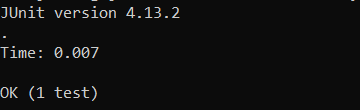

# Servers and Bugs: How I Learned That Good Code Is a Myth

these titles and quotes were supposed to all fit together and i was going to write this entire report as a dramatic narrative about going insane while trying to debug code before finally finding sanity in the form of new knowledge

but i ran out of time while i was working on the dialogue so i decided to just submit a pretty plain lab report

next time, i promise!

## Part 1: The Descent into Madness
> If I am mad, it is mercy! May the gods pity the man who in his callousness can remain sane to the hideous end!

*-- H.P. Lovecraft, The Temple*

Luckily for us, most of this task can be replicated from existing server code. Since most of this code is from previous in-class examples, very little of it bears repeating. See below for the full source of the program.


Now, see the program in action:

`Handler.handleRequest(new URI("http://localhost:8080/add-message?s=test")` is called when this first request is made. At this time, session_string is equal to "". `url.getPath()` returns `/add-message?s=test` and `url.getQuery()` returns `s=test`.

Since this URL's path contains "add-message" and a valid querystring, "test\n" is appended to `session_string`, which becomes "test\n".

Now, we run it again with a second parameter:

`Handler.handleRequest(new URI("http://localhost:8080/add-message?s=test2")` is called when this second request is made. At this time, session_string is equal to "test\n". `url.getPath()` returns `/add-message?s=test2` and `url.getQuery()` returns `s=test2`.

Since this URL's path contains "add-message" and a valid querystring, "test2\n" is appended to `session_string`, which becomes "test\ntest2\n".


## Part 2: A Glimpse of Sanity
> Aha! In the distance  
A small cottage with a light on  
Hope! You move stealthily toward it

*-- Rob Cantor, Shia LaBeouf*

In `ArrayExamples.java`, the implementation of the `reverseInPlace` method is faulty. Below is the offending method:
```java
static void reverseInPlace(int[] arr) {
  for(int i = 0; i < arr.length; i += 1) {
    arr[i] = arr[arr.length - i - 1];
  }
}
```

The bug here becomes evident when we supply any array larger than size `1`. For example, consider the following test:

```java
@Test 
public void testReverseInPlace() {
  int[] input = { 1, 2, 3, 4, 5 };
  ArrayExamples.reverseInPlace(input);
  assertArrayEquals(new int[]{ 5, 4, 3, 2, 1 }, input);
}
```

The test fails with the following message:


However, for an array of size `1`, there is no error. Consider the following test:
```java
@Test 
public void testReverseInPlace() {
  int[] input = { 1 };
  ArrayExamples.reverseInPlace(input);
  assertArrayEquals(new int[]{ 1 }, input);
}
```

This test has no such error:



The bug results from a common mistake with in-place operations. When performed linearly, an in-place operation must *never* reference objects before the current position. This is because previous data has already been modified. Thus, we are mixing old data and new data, which will cause errors. To resolve this issue, we can instead iterate over only *half* of the array and swap *both* corresponding entries, like so:

```java
static void reverseInPlace(int[] arr) {
  for(int i = 0; i < arr.length/2; i += 1) {
    arr[i] ^= arr[arr.length - i - 1];
    arr[arr.length - i - 1] ^= arr[i];
    arr[i] ^= arr[arr.length - i - 1];
  }
}
```

Note the addition of lines `4` and `5`, as well as the modification of line `3`. This passes our tests, as evidenced by the screenshot below.


To further illustrate the bug, behold my terrible ASCII graphical representation.

Buggy behavior:
```
[1, 2, 3, 4, 5]
[5, 2, 3, 4, 5]
[5, 4, 3, 4, 5]
[5, 4, 3, 4, 5]
[5, 4, 3, 4, 5] <-- 4 is assigned to the item at index 1, WHICH HAS ALREADY BEEN UPDATED
[5, 4, 3, 4, 5] <-- see above
```

Fixed behavior:
```
[1, 2, 3, 4, 5]
[5, 2, 3, 4, 1]
[5, 4, 3, 2, 1]
```

## Part 3: Home at Last
> We mounted up, he first and I the second,  
  Till I beheld through a round aperture  
  Some of the beauteous things that Heaven doth bear;  
  \  
  Thence we came forth to rebehold the stars.

*-- Dante Alighieri, Divine Comedy*

This is going to sound kind of dumb, but I learned that you can directly concatenate strings in Java. I don't know why, but I assumed that you couldn't do that. I figured that the StringBuilder object existed for a reason, and that `str += "to_concatenate"` just didn't work in Java, even though clearly that's a valid variable assignment. While I was writing the code for this lab report (and for our search engine in Week 2), I wrote it by reflex and then it compiled without error. It's a small thing, I know, but I was still surprised!